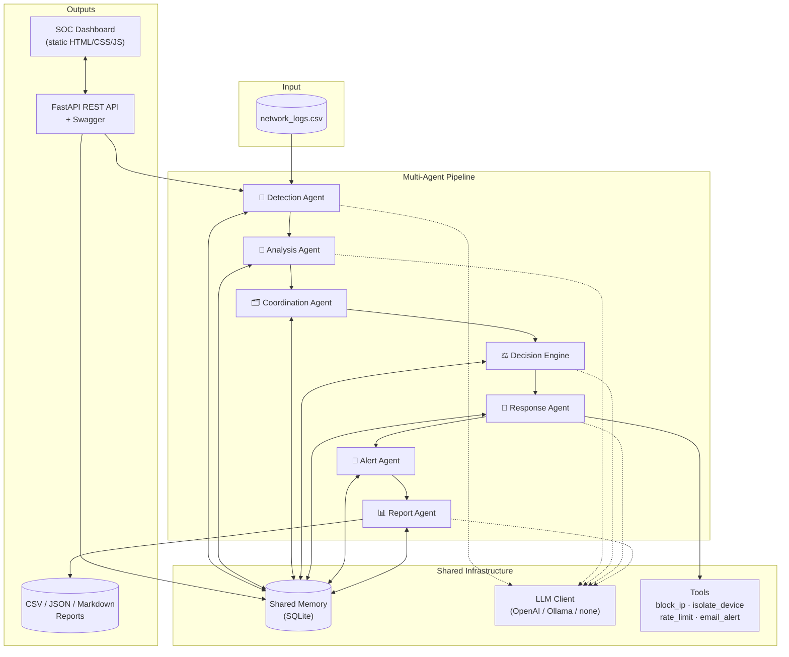
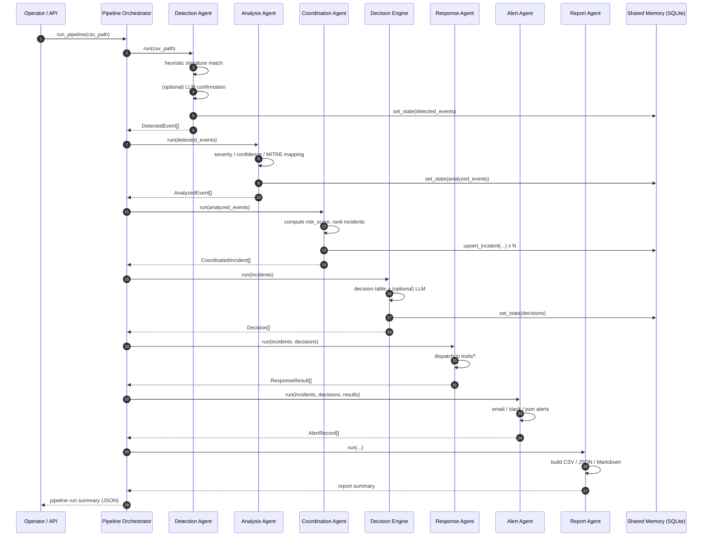

# 🛡️ AI Cyber Attack Response Coordinator

An enterprise-grade, **multi-agent AI cybersecurity incident response system**
with a full **FastAPI backend** and a built-in **SOC dashboard frontend**.
Seven specialized agents collaborate — through a shared, persistent memory
layer — to **detect, analyze, prioritize, respond to, and report on** cyber
attacks, from raw network logs to an executive-ready incident report, all
visible live in the browser.

Every agent works with **or without an LLM**: each stage runs a fast,
deterministic heuristic engine by default, and transparently upgrades to
LLM-refined reasoning (OpenAI or Ollama) when a provider is configured. This
means the system is demoable, testable, and CI-friendly with **zero API
keys**, while still being LLM-native and easily extended.

---

## Table of Contents

- [Architecture](#architecture)
- [Multi-Agent Workflow](#multi-agent-workflow)
- [Sequence Diagram](#sequence-diagram)
- [Milestone 4 Status](#milestone-4-status)
- [Project Structure](#project-structure)
- [Quick Start](#quick-start)
- [Configuration](#configuration)
- [Running the Pipeline](#running-the-pipeline)
- [Frontend Dashboard](#frontend-dashboard)
- [REST API](#rest-api)
- [Monitoring & Metrics](#monitoring--metrics)
- [Performance Testing](#performance-testing)
- [Docker](#docker)
- [Cloud Deployment](#cloud-deployment)
- [Testing](#testing)
- [Output Files](#output-files)
- [Extending the System](#extending-the-system)
- [Design Notes](#design-notes)

---

## Architecture



## Multi-Agent Workflow

| # | Agent | File | Responsibility |
|---|-------|------|-----------------|
| 1 | — | `agents/detection_agent.py` | Loads `network_logs.csv`, flags suspicious entries |
| 2 | Detection | `agents/detection_agent.py` | Classifies attack category (SQLi, Brute Force, DDoS, Port Scan, Malware, Ransomware, Phishing, Priv-Esc) |
| 3 | Analysis | `agents/analysis_agent.py` | Severity, confidence, business impact, MITRE ATT&CK technique |
| 4 | Coordination | `agents/coordination_agent.py` | Computes a 0–100 risk score and ranks incidents |
| 5 | Decision Engine | `agents/decision_engine.py` | Chooses the best automated response action |
| 6 | Response | `agents/response_agent.py` | Executes the action via `tools/` (block IP, isolate device, etc.) |
| 7 | Alert | `agents/alert_agent.py` | Sends email / Slack / JSON alerts |
| 8 | Report | `agents/report_agent.py` | Produces CSV, JSON, Markdown reports + executive summary |

## Sequence Diagram



## Milestone 4 Status

Milestone 4 ("Workflow Automation & Deployment," weeks 7-8) is **complete**.
Mapping deliverables to what's in this repo:

| Deliverable | Where |
|---|---|
| Complex workflow orchestration | `pipeline.py` — 8-stage orchestrator with per-stage timing, status tracking (`pending → running → done/error`), and a shared-memory-backed live status feed |
| REST APIs | `api/app.py` — `/pipeline/run`, `/pipeline/status`, `/incidents*`, `/reports/summary`, `/events`, `/metrics` |
| Monitoring dashboard | `frontend/` — SOC dashboard with a live **Agent workflow** panel (real-time per-stage status/duration), risk pulse, incident queue, and audit event stream |
| Cloud deployment | `deploy/` — Kubernetes manifests (`deploy/k8s/`) + a per-cloud (Azure/AWS/GCP) walkthrough in `deploy/README.md`, on top of the existing `Dockerfile` / `docker-compose.yml` |
| Performance testing & optimization | `scripts/perf_test.py` (zero-dependency load test) + `tests/performance/locustfile.py` (optional Locust profile) — see [Performance Testing](#performance-testing) |
| Monitoring, logging, scalability | `GET /metrics` (Prometheus format), structured logs in `logs/`, K8s `HorizontalPodAutoscaler` in `deploy/k8s/hpa.yaml` |

## Project Structure

```
AI_Cyber_Attack_Response/
│
├── agents/
│   ├── base_agent.py          # shared logging / memory / LLM-fallback plumbing
│   ├── detection_agent.py
│   ├── analysis_agent.py
│   ├── coordination_agent.py
│   ├── decision_engine.py
│   ├── response_agent.py
│   ├── alert_agent.py
│   └── report_agent.py
│
├── tools/
│   ├── block_ip.py
│   ├── isolate_device.py
│   ├── rate_limit.py
│   └── email_alert.py
│
├── prompts/
│   ├── detection.txt
│   ├── analysis.txt
│   ├── decision.txt
│   ├── response.txt
│   └── report.txt
│
├── memory/
│   └── shared_memory.py       # SQLite-backed shared state + audit log
│
├── api/
│   └── app.py                 # FastAPI REST API + Swagger docs + serves the dashboard
│
├── frontend/
│   ├── index.html              # SOC dashboard shell (single page, no build step)
│   └── static/
│       ├── style.css           # dashboard visual identity (SOC command-center theme)
│       └── app.js               # fetch-based dashboard logic against the REST API
│
├── data/
│   ├── network_logs.csv       # sample input dataset
│   └── *.csv                  # generated intermediate + final outputs
│
├── reports/                   # generated incident_report.md / .json
├── logs/                      # rotating structured application logs
├── tests/                     # pytest unit + integration tests
│   └── performance/
│       └── locustfile.py      # optional Locust load-test profile
├── scripts/
│   └── perf_test.py           # zero-dependency load/performance test
├── deploy/
│   ├── README.md               # Azure / AWS / GCP deployment walkthrough
│   └── k8s/
│       ├── deployment.yaml     # K8s Deployment (readiness/liveness probes)
│       ├── service.yaml        # K8s Service (LoadBalancer)
│       └── hpa.yaml            # HorizontalPodAutoscaler (2-6 replicas on CPU)
├── .github/workflows/ci.yml   # CI/CD pipeline
├── config.py                  # centralized, validated settings (.env)
├── logging_setup.py           # structured logging configuration
├── llm_client.py              # provider-agnostic LLM wrapper (OpenAI/Ollama/none)
├── models.py                  # shared Pydantic data models
├── pipeline.py                # orchestrates all agents end-to-end
├── main.py                    # CLI entry point
├── requirements.txt
├── Dockerfile
├── docker-compose.yml
└── README.md
```

## Quick Start

```bash
# 1. Clone / unzip the project, then:
cd AI_Cyber_Attack_Response
python3.12 -m venv .venv && source .venv/bin/activate
pip install -r requirements.txt

# 2. Configure environment
cp .env.example .env
# Edit .env if you want LLM-backed reasoning (LLM_PROVIDER=openai|ollama).
# Defaults to LLM_PROVIDER=none — fully functional heuristic mode, no API key needed.

# 3. Run the full pipeline against the sample dataset (CLI)
python main.py

# 4. Or launch the backend + dashboard together
uvicorn api.app:app --reload
# Dashboard:    http://localhost:8000/
# Swagger docs: http://localhost:8000/docs
```

## Configuration

All configuration lives in `.env` (see `.env.example`), loaded via
`config.py` (Pydantic Settings). Key variables:

| Variable | Purpose | Default |
|---|---|---|
| `LLM_PROVIDER` | `openai` \| `ollama` \| `none` | `none` |
| `OPENAI_API_KEY` / `OPENAI_MODEL` | OpenAI credentials + model | — |
| `OLLAMA_BASE_URL` / `OLLAMA_MODEL` | Local Ollama server | `http://localhost:11434` |
| `DRY_RUN` | Simulate response/alert actions instead of executing them | `true` |
| `SLACK_WEBHOOK_URL` | Enables Slack alerting | — |
| `SMTP_*`, `ALERT_EMAIL_*` | Email alert delivery | — |

## Running the Pipeline

```bash
# Default dataset
python main.py

# Custom dataset
python main.py --csv path/to/other_logs.csv

# Keep prior shared-memory state (audit/resume mode)
python main.py --no-clear
```

Each run prints a JSON summary and writes every intermediate + final
artifact under `data/` and `reports/` (see [Output Files](#output-files)).

### Using your own CSV

Any CSV with at least `log_id`, `timestamp`, `source_ip`, `destination_ip`
columns works (`destination_port`, `protocol`, `user`, `asset`,
`asset_criticality`, `bytes_transferred`, `request_count`,
`payload_snippet`, `status` are optional). Three ways to point the pipeline
at it:

1. **Dashboard** — click **Upload CSV** in the top bar, pick your file. The
   dashboard validates it, shows the row/column count, and the next click
   of **Run pipeline** processes that file instead of the sample data
   (label in the top bar shows which dataset is active).
2. **CLI** — `python main.py --csv path/to/your_logs.csv`
3. **API** — `POST /pipeline/upload-csv` (multipart file upload) returns a
   `csv_path`, then pass that to `POST /pipeline/run`:
   ```bash
   curl -X POST http://localhost:8000/pipeline/upload-csv -F "file=@my_logs.csv"
   # -> {"csv_path": "data/uploads/20260817T104630Z_..._my_logs.csv", "rows": 42, ...}
   curl -X POST http://localhost:8000/pipeline/run \
     -H "Content-Type: application/json" \
     -d '{"csv_path": "data/uploads/20260817T104630Z_..._my_logs.csv"}'
   ```

Uploads are saved under `data/uploads/` with a timestamp + random suffix so
they never collide with each other or overwrite the bundled sample dataset.

## Frontend Dashboard

A zero-build-step SOC dashboard is served by the same FastAPI process at `/`
(static HTML/CSS/JS under `frontend/`, mounted at `/assets`). It talks to the
JSON API below over same-origin `fetch` calls — no separate frontend server,
no `npm install`, works the same locally or in the Docker container.

What it shows:

- **Upload CSV** — feed in your own network-log dataset instead of the
  bundled sample; validated client- and server-side, with the active
  dataset shown next to the button. See
  [Using your own CSV](#using-your-own-csv).
- **Agent workflow** — a live, animated node chain for the 8-stage pipeline
  (detection → analysis → coordination → decision → response → alert →
  report). Each node shows pending/running/done/error state and its
  duration in milliseconds, polled from `/pipeline/status` in real time
  while a run is in flight — this is the "monitor agent activities and
  workflows" requirement made visible.
- **Risk pulse** — a live sparkline of every incident's risk score, ranked
  and color-coded by severity, with a moving scan-line and per-incident dots.
- **Incident queue** — a sortable, severity-left-bordered table; click any
  row to open a detail drawer with full impact, MITRE mapping, decision
  justification, and response/runbook detail.
- **Run summary + severity breakdown** — logs processed, incidents raised,
  auto-responded vs. pending human approval, alerts sent.
- **Executive summary** — the same narrative written by the Report Agent.
- **Audit event stream** — a collapsible tail of every agent action, polled
  from `/events`.
- **Approve action** — for incidents whose response was deferred pending
  human approval, approve directly from the drawer; it calls
  `POST /incidents/{id}/approve` and refreshes the board.

Click **Run pipeline** in the top bar to execute the full 8-stage workflow
against `data/network_logs.csv` and watch both the workflow panel and the
board populate in real time.

## REST API

```bash
uvicorn api.app:app --reload
# Swagger UI:  http://localhost:8000/docs
# ReDoc:       http://localhost:8000/redoc
```

| Method | Path | Description |
|---|---|---|
| GET | `/health` | Liveness probe |
| POST | `/pipeline/upload-csv` | Upload a custom network-log CSV (multipart); returns a `csv_path` |
| POST | `/pipeline/run` | Trigger a full pipeline run |
| GET | `/pipeline/status` | Live per-stage workflow status (pending/running/done/error + duration) |
| GET | `/incidents` | List all tracked incidents |
| GET | `/incidents/{id}` | Full detail for one incident |
| POST | `/incidents/{id}/approve` | Approve a deferred, human-gated response action |
| GET | `/reports/summary` | Latest executive summary + severity breakdown |
| GET | `/events` | Full audit-log event stream |
| GET | `/metrics` | Prometheus-compatible plaintext metrics (requests, pipeline runs, stage durations) |

## Monitoring & Metrics

Beyond the dashboard's live **Agent workflow** panel, the API exposes two
machine-readable monitoring surfaces:

- **`GET /pipeline/status`** — the same per-stage status/duration data the
  dashboard polls, useful for scripted health checks ("is the pipeline
  stuck on `analysis`?").
- **`GET /metrics`** — Prometheus text-exposition format: HTTP request
  counts/latency by route, pipeline run counts (+ errors), per-stage
  durations from the most recent run, and the current tracked-incident
  count. Point a Prometheus `scrape_config` at it, or just `curl` it for a
  quick snapshot:

  ```bash
  curl http://localhost:8000/metrics
  ```

No external dependency (`prometheus_client`, a sidecar, etc.) is required —
the exposition format is plain text, generated directly in `api/app.py`.

## Performance Testing

Two options are provided, both under Module 5's "Conduct performance
testing and optimization":

```bash
# 1. Zero-dependency load test (stdlib only) -- works anywhere the API runs
uvicorn api.app:app &                 # start the API first
python scripts/perf_test.py --base-url http://localhost:8000 --concurrency 10 --requests 100
```

This hits `/health`, `/incidents`, `/reports/summary`, `/pipeline/status`,
and `/pipeline/run` concurrently and prints p50/p95/p99 latency + throughput
per endpoint.

```bash
# 2. Locust, if you have it installed -- ramping load profile + web UI
pip install locust
locust -f tests/performance/locustfile.py --host http://localhost:8000
# open http://localhost:8089, or run headless with -u/-r/-t flags
```

**Reading the results / where to optimize:** the heuristic-only pipeline
(`LLM_PROVIDER=none`) runs the full 8-stage workflow against the sample
dataset in well under 100ms, so at low volume the API is effectively
I/O-bound on SQLite writes. If you enable an LLM provider, `/pipeline/run`
latency will be dominated by LLM round-trips instead — the retry/backoff +
heuristic-fallback design in `agents/base_agent.py` already bounds the
worst case. For higher incident volumes, the main lever is horizontal
scaling (see the K8s `HorizontalPodAutoscaler` below) since each pipeline
run is independent and stateless aside from the shared SQLite file.

## Docker

```bash
docker compose up --build
# Dashboard:    http://localhost:8000/
# Swagger docs: http://localhost:8000/docs

# Optional local Ollama profile:
docker compose --profile local-llm up
```

## Cloud Deployment

Full walkthrough (image build/push, per-cloud one-liners for Azure
Container Apps / AWS App Runner / GCP Cloud Run, and Kubernetes manifests
for AKS/EKS/GKE) lives in **[`deploy/README.md`](deploy/README.md)**.
Short version:

```bash
docker build -t ai-cyber-response:1.0.0 .
# push to your cloud's registry (ACR/ECR/Artifact Registry), then:
kubectl apply -f deploy/k8s/deployment.yaml
kubectl apply -f deploy/k8s/service.yaml
kubectl apply -f deploy/k8s/hpa.yaml   # optional autoscaling, 2-6 replicas
```

The K8s Deployment wires `/health` in as both the readiness and liveness
probe, so a bad rollout is caught before it takes traffic, and the HPA
scales on CPU utilization to satisfy the "scalability" requirement without
any custom autoscaling code.

## Testing

```bash
pytest -v
```

21 unit + integration tests cover detection heuristics, severity/MITRE
classification, risk scoring, decision logic, response tool execution
(dry-run), the full pipeline orchestrator, workflow stage-timing tracking,
the `/metrics` endpoint, and the REST API — all running in heuristic-only
mode (`LLM_PROVIDER=none`) so CI needs no external credentials.

## Output Files

| File | Produced by | Contents |
|---|---|---|
| `data/detected_logs.csv` | Detection Agent | Every log entry + suspicion verdict |
| `data/analyzed_logs.csv` | Analysis Agent | Suspicious events + severity/MITRE |
| `data/coordinated_tasks.csv` | Coordination Agent | Ranked incident queue |
| `data/decision_output.csv` | Decision Engine | Chosen action per incident |
| `data/response_output.csv` | Response Agent | Execution results |
| `data/alert_output.csv` | Alert Agent | Email/Slack/JSON alert records |
| `data/final_report.csv` | Report Agent | Flattened, full-pipeline incident table |
| `reports/incident_report.json` | Report Agent | Structured full report |
| `reports/incident_report.md` | Report Agent | Human-readable Markdown report |

## Extending the System

- **New attack signature**: add a regex rule to `_SIGNATURES` in
  `agents/detection_agent.py`.
- **New response action**: implement it in `agents/response_agent.py`'s
  dispatch table (and, if reusable, factor it into `tools/`).
- **New agent**: subclass `agents.base_agent.BaseAgent`, wire it into
  `pipeline.py`, and add a prompt template under `prompts/` if it uses
  the LLM.
- **New LLM provider**: extend `llm_client.py`'s `LLMClient` with another
  `_build_<provider>_model()` method.

## Design Notes

- **Resilience over automation-at-all-costs**: every LLM call is wrapped
  with retries + a deterministic heuristic fallback, so the system degrades
  gracefully rather than failing outright on any LLM/network hiccup.
- **Human-in-the-loop safety gate**: disruptive actions
  (`isolate_device`, `disable_user`, `quarantine_device`) require human
  approval unless the incident is `Critical` severity, bounding the blast
  radius of full automation.
- **Dry-run by default**: `DRY_RUN=true` out of the box — no real firewall,
  EDR, or SMTP calls happen until explicitly enabled.
- **Auditable by construction**: every agent action is persisted to the
  SQLite-backed shared memory's `events` table, in addition to the CSV/JSON
  report artifacts.
